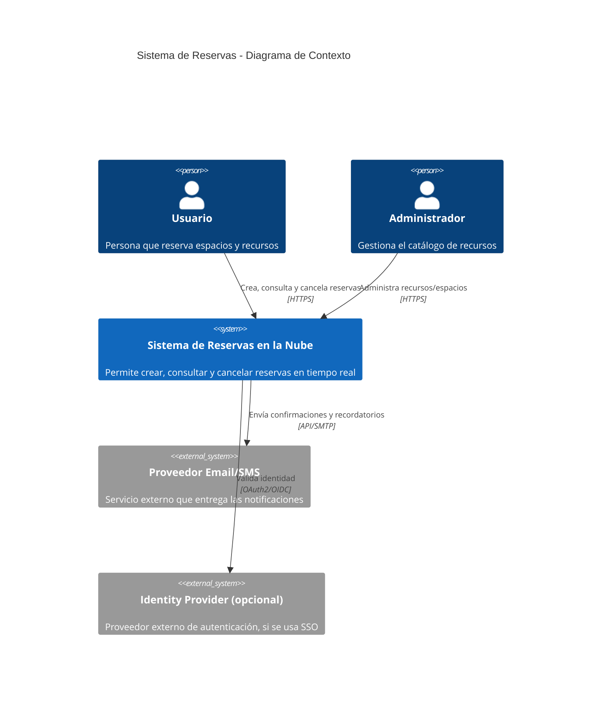
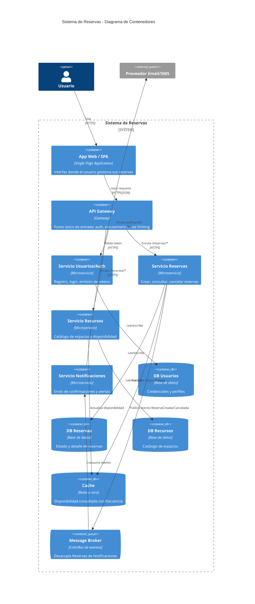
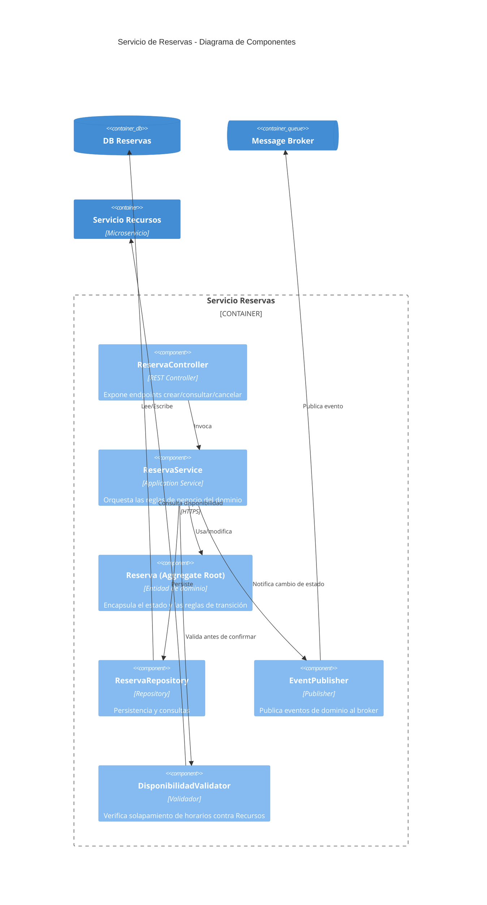
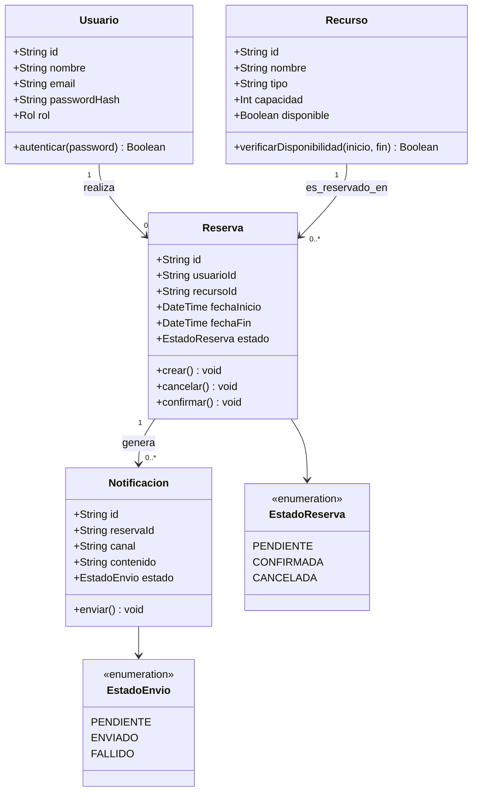

# Sistema de Reservas en la Nube
### Documentación de Arquitectura — Evaluación Módulo 2 (Alkemy, Arquitecto Cloud)

---

## 1. Contexto y objetivo

Se diseña la arquitectura de un **sistema de reservas en la nube** que permite a los usuarios reservar espacios y recursos. La arquitectura debe ser:

- **Escalable**: soportar picos de demanda con expansión horizontal automática.
- **Segura**: proteger datos de usuario mediante autenticación y encriptación.
- **Flexible**: permitir modificaciones sin afectar la estructura principal (bajo acoplamiento).

El diseño es **agnóstico de proveedor** (no se ata a AWS, Azure o GCP), aplicando conceptos y patrones que se pueden implementar en cualquiera de los tres. Al final se incluye una tabla de equivalencias por si se decide implementar.

---

## 2. Backlog de tareas (referencial)

Elaborado a partir de los requerimientos generales y técnicos del PDF, ya que no se entregó un backlog explícito por parte del líder técnico. Se prioriza con escala simple **Alta / Media / Baja**, pensando en qué historias bloquean a las demás.

| ID | Historia de usuario | Criterios de aceptación | Prioridad |
|---|---|---|---|
| HU-01 | Como usuario, quiero registrarme e iniciar sesión, para acceder al sistema de forma segura. | - Se valida email único. - Password se almacena hasheado, nunca en texto plano. - Se emite un token (JWT) al loguear. | Alta |
| HU-02 | Como usuario autenticado, quiero ver el catálogo de espacios/recursos disponibles, para elegir qué reservar. | - Lista solo recursos marcados como `disponible`. - Tiempo de respuesta < 1s con catálogo de hasta 500 ítems. | Alta |
| HU-03 | Como usuario, quiero crear una reserva sobre un recurso en una fecha/hora específica, para asegurar su uso. | - No permite crear si el horario se solapa con otra reserva del mismo recurso. - Reserva queda en estado `PENDIENTE`. | Alta |
| HU-04 | Como usuario, quiero consultar mis reservas activas, para saber qué tengo agendado. | - Devuelve solo reservas del usuario autenticado. - Filtra por estado (pendiente/confirmada/cancelada). | Alta |
| HU-05 | Como usuario, quiero cancelar una reserva propia, para liberar el recurso si ya no la necesito. | - Solo el dueño de la reserva puede cancelarla. - Al cancelar, el recurso vuelve a quedar disponible para ese horario. | Alta |
| HU-06 | Como usuario, quiero recibir una notificación al confirmar o cancelar una reserva, para estar al tanto del estado. | - Se envía notificación async (no bloquea la respuesta de la reserva). - Si falla el envío, se reintenta al menos 1 vez. | Media |
| HU-07 | Como administrador, quiero dar de alta/baja recursos del catálogo, para mantenerlo actualizado. | - Solo usuarios con rol `admin` pueden modificar el catálogo. - Cambios se reflejan en el catálogo en menos de 5s. | Media |
| HU-08 | Como responsable técnico, quiero que el sistema escale automáticamente ante picos de demanda, para mantener tiempos de respuesta estables. | - Se definen métricas de auto-scaling (CPU/requests). - Tiempo de respuesta no debe degradarse más de X% bajo carga simulada. | Alta |
| HU-09 | Como responsable técnico, quiero que los datos de usuario estén encriptados en tránsito y en reposo, para cumplir con seguridad básica. | - Todo el tráfico usa HTTPS. - Passwords y datos sensibles encriptados en la base de datos. | Alta |
| HU-10 | Como equipo de desarrollo, quiero pruebas unitarias sobre las reglas de negocio críticas, para evitar regresiones. | - Cobertura mínima sobre `Reserva` (crear, cancelar, validar solapamiento). - Pruebas corren en CI antes de cada merge. | Media |

**Cómo se usa este backlog en el resto del documento:** las historias de prioridad Alta (HU-01 a HU-05, HU-08, HU-09) son las que determinan qué componentes son indispensables en el diagrama C4 y cuáles reglas de negocio debe cubrir el diagrama de clases — por eso el modelo de dominio de la sección 5 gira en torno a `Reserva` y su ciclo de estados, que es justamente lo que HU-03/04/05 necesitan.

---

## 3. Estilo arquitectónico: Microservicios

Se elige **arquitectura de microservicios** (en vez de monolito) porque:

| Criterio del proyecto | Por qué microservicios cumple |
|---|---|
| Escalabilidad ante picos | Cada servicio escala de forma independiente (ej: en temporada alta, "Reservas" escala sin tocar "Notificaciones") |
| Modificación sin afectar estructura | Cada servicio se despliega y versiona por separado |
| Mantenimiento y legibilidad | Equipos pequeños dueños de un dominio acotado |
| Resiliencia | Si "Notificaciones" falla, "Reservas" sigue funcionando |

---

## 4. Diagrama de arquitectura — Notación C4

Se documenta en 3 niveles del modelo C4: **Contexto**, **Contenedores** y **Componentes** (del servicio más crítico, Reservas). No se incluye el nivel "Código" porque no aplica a un diseño agnóstico sin stack definido.

### 4.1 Nivel 1 — Diagrama de Contexto

Muestra el sistema como una caja negra y cómo interactúa con usuarios y sistemas externos.

### 4.2 Nivel 2 — Diagrama de Contenedores

Abre la caja negra y muestra los "contenedores" (aplicaciones/servicios desplegables) que componen el sistema y cómo se comunican.

### 4.3 Nivel 3 — Diagrama de Componentes (Servicio de Reservas)

Se profundiza en el microservicio más crítico del dominio, mostrando su estructura interna.

> **Nota sobre la notación:** C4 en Mermaid es soportado pero algo más limitado en estilos que C4-PlantUML o herramientas como Structurizr. Si tu rúbrica exige fidelidad estricta al estándar C4 (con leyenda de colores, boundaries anidados, etc.), te recomiendo además generar una versión en [Structurizr](https://structurizr.com/) o draw.io con la plantilla C4 — el contenido conceptual (qué cajas y relaciones van) ya está resuelto acá, solo cambiaría la herramienta de renderizado.

### 4.4 Justificación de decisiones clave

- **API Gateway**: único punto de entrada. Centraliza auth (valida JWT antes de enrutar), rate limiting y logging. Evita que cada microservicio reimplemente esta lógica.
- **Load Balancer + auto-scaling**: distribuye tráfico entre instancias de cada servicio; nuevas instancias se levantan automáticamente según CPU/memoria o cantidad de requests (cumple el requisito de "picos de demanda").
- **Database per service**: cada microservicio tiene su propia base de datos. Evita acoplamiento por esquema compartido y permite elegir el motor más adecuado por servicio (ej: relacional para Reservas por las transacciones, documental para Recursos si el catálogo es muy variable).
- **Message Broker (eventos asíncronos)**: "Reservas" no llama directamente a "Notificaciones". Publica un evento (`ReservaCreada`, `ReservaCancelada`) y el broker lo entrega. Esto desacopla los servicios: si Notificaciones está caída o lenta, no bloquea la creación de la reserva.
- **Cache (Redis u otro)**: para consultas de alta frecuencia y baja mutabilidad (ej: catálogo de espacios disponibles), reduciendo carga sobre la base de datos.
- **CDN + WAF**: la capa "Edge" protege contra ataques comunes (DDoS, inyección) antes de que el tráfico llegue a la infraestructura interna.

---

## 5. Seguridad

| Mecanismo | Dónde se aplica |
|---|---|
| Autenticación con JWT (access + refresh token) | API Gateway valida el token en cada request |
| Encriptación en tránsito (TLS/HTTPS) | Todo el tráfico cliente→edge→servicios |
| Encriptación en reposo | Bases de datos y backups |
| Rate limiting / throttling | API Gateway, por usuario/IP |
| Principio de mínimo privilegio | Cada microservicio solo accede a su propia base de datos (credenciales separadas, no una DB compartida con acceso total) |
| Validación de inputs | En cada microservicio, antes de tocar la base de datos (previene inyección) |
| Secrets management | Variables sensibles (API keys, connection strings) en un gestor de secretos (no hardcodeadas ni en el repo) |

---

## 6. Diagrama de clases (dominio)

Modelo de dominio simplificado, centrado en el flujo de reserva:

**Nota de diseño:** `Reserva` es el agregado central. Cualquier cambio de estado (crear, cancelar, confirmar) dispara la publicación de un evento de dominio, que es lo que consume el servicio de Notificaciones — así se mantiene la separación entre microservicios incluso a nivel de modelo.

---

## 7. Escalabilidad y rendimiento

- **Stateless services**: ningún microservicio guarda sesión en memoria local; el estado vive en la DB o cache compartida. Esto permite levantar/matar instancias libremente sin perder datos de sesión.
- **Auto-scaling horizontal**: reglas basadas en métricas (CPU, memoria, cantidad de requests en cola) para sumar/restar instancias.
- **Particionamiento de carga**: el servicio de Reservas (el más sensible a concurrencia) puede escalar independiente del resto.
- **Circuit breaker**: si un microservicio downstream no responde, el gateway/cliente HTTP corta la llamada tras N reintentos en vez de colgar el request (evita efecto cascada).
- **Health checks**: cada servicio expone un endpoint `/health` que el orquestador usa para saber si debe reemplazar una instancia.

---

## 8. Estrategia de pruebas

| Tipo | Qué valida | Ejemplo de herramienta (referencial) |
|---|---|---|
| Unitarias | Lógica de negocio aislada (ej: `Reserva.cancelar()` no permite cancelar una ya `CANCELADA`) | JUnit, xUnit, Jest según stack |
| Integración | Comunicación real entre un servicio y su DB/broker | Testcontainers |
| Carga (load testing) | Comportamiento bajo múltiples solicitudes concurrentes | k6, JMeter, Gatling |
| Contract testing | Que el contrato de la API entre Gateway↔microservicio no se rompa al desplegar | Pact |

El informe de pruebas (entregable separado) debe documentar: escenarios probados, resultados (tiempos de respuesta, tasa de error bajo carga) y acciones correctivas si se detectaron cuellos de botella.

---

## 9. Equivalencias por proveedor (referencia rápida)

| Componente conceptual | AWS | Azure | GCP |
|---|---|---|---|
| API Gateway | API Gateway | API Management | API Gateway |
| Contenedores orquestados | ECS / EKS | AKS | GKE / Cloud Run |
| Message Broker | SQS / SNS | Service Bus | Pub/Sub |
| Cache | ElastiCache | Azure Cache for Redis | Memorystore |
| Auto-scaling | Auto Scaling Groups | VM Scale Sets / AKS HPA | Managed Instance Groups / GKE HPA |
| Secrets | Secrets Manager | Key Vault | Secret Manager |
| CDN/WAF | CloudFront + WAF | Front Door + WAF | Cloud CDN + Armor |

---

## 10. Próximos pasos sugeridos

1. Definir el stack de implementación por servicio.
2. Levantar el diagrama de despliegue (contenedores, redes, VPC) a partir de este diseño.
3. Escribir las pruebas unitarias del dominio (`Reserva`, `Recurso`) antes de implementar infraestructura.
4. Documentar el informe de pruebas de carga una vez exista un ambiente desplegado.
